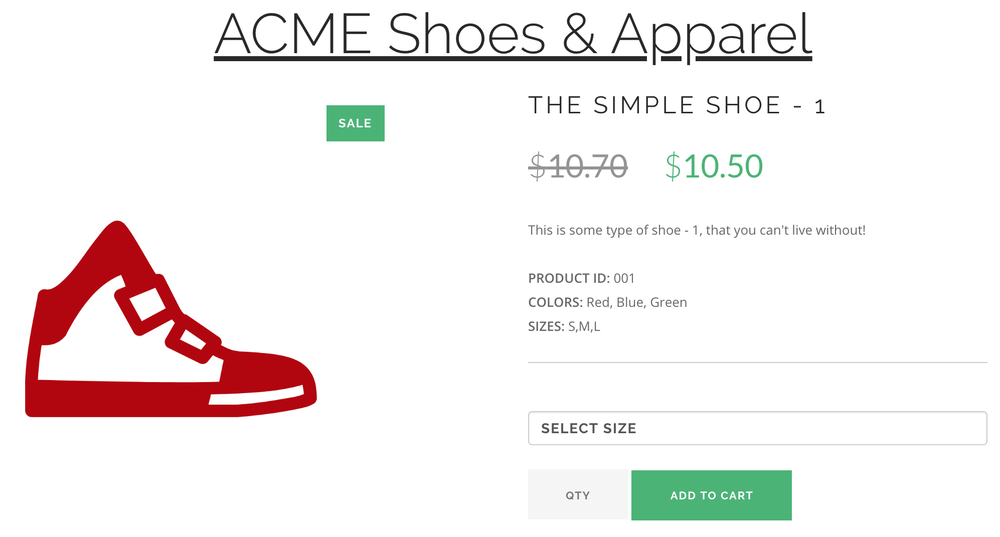

# netifi-acmeshoes
Simple store application that composes calls to backend product information services and displays a product page.

This example application shows you how to build microservice architectures using [Netifi](https://www.netifi.com) and [RSocket](http://rsocket.io).

## What is Netifi?
[Netifi](https://www.netifi.com) is a platform for building cloud-native applications with the power of [RSocket](http://rsocket.io).

Netifi provides service discovery, load-balancing, streaming, and back-pressure without deploying a whole host of infrastructure 
components and without polluting your code with circuit breakers and client-side load-balancing. 

Check out [www.netifi.com](https://www.netifi.com) for more information.

## Project Structure
The application contains a number of backend microservices that are called by the [store-app](store-app) to retrieve product information necessary to display a Product Details Page (PDP).

The APIs for the backend services are defined as Protobuf contracts in the `-idl` projects. These projects, when built, generate service stubs and clients that are imported and used by
the service and store-app projects.

## Prerequisites
This application requires a running instance of the Netifi Broker.

Run the following command to download the [Netifi Community Edition Broker](https://www.netifi.com/netifi-ce) as a Docker container:

    docker pull netifi/broker:1.6.9

## Building AcmeShoes
The application can be built as JARs or Docker images.

### JAR
Run the following command to build the application:

    ./gradlew clean build
    
When developing in an IDE and modifying the IDL projects you may need to refresh your project classpath in order to see the changes take effect. When using IntelliJ, you can refresh the
project classpath by clicking the refresh button in the `Gradle` tab.

### Docker
Run the following command to build the application as Docker images:

    ./gradlew clean buildImage
    
If the build is successful, you will see the following Docker images in your local Docker registry:

    gregnetifi/acmeshoes-store-app              0.1.0
    gregnetifi/acmeshoes-store-app              latest
    gregnetifi/acmeshoes-product-service        0.1.0 
    gregnetifi/acmeshoes-product-service        latest
    gregnetifi/acmeshoes-inventory-service      0.1.0
    gregnetifi/acmeshoes-inventory-service      latest
    
## Running AcmeShoes
Follow the steps below to run the application.

### JAR
Follow the steps below to run the application as JARs using Gradle:

1. Run the following command to start a Netifi Broker:

        docker run \
        -p 8001:8001 -p 8101:8101 -p 7001:7001 -p 6001:6001 \
        -e BROKER_SERVER_OPTS="'-Dnetifi.broker.admin.accessKey=8833333111127534' \
        '-Dnetifi.broker.admin.accessToken=Ih+hNsSdxLxAtHceTeEia2MGXSc=' \
        '-Dnetifi.authentication.0.accessKey=8833333111127534'
        '-Dnetifi.authentication.0.accessToken=Ih+hNsSdxLxAtHceTeEia2MGXSc=' \
        '-Dnetifi.broker.ssl.disabled=true'"  \
        netifi/broker:1.6.9

2. In a new terminal, run the following command to start the `inventory-service`:

        ./gradlew :inventory-service:run
        
3. In a new terminal, run the following command to start the `product-service`:

        ./gradlew :product-service:run
        
4. In a new terminal, run the following command to start the `store-app`:

        ./gradlew :store-app:run
        
5. In web browser, navigate to [http://localhost:8080/product/001](http://localhost:8080/product/001) to view the PDP page.

### Docker
A Docker Compose file has been provided to make running the Acme Shoes application as a set of Docker containers simple.

1. Run the following command to start a single Netifi Broker and the Acme Shoes application:

        docker-compose up
        
2. In web browser, navigate to [http://localhost:8080/product/001](http://localhost:8080/product/001) to view the PDP page.

## Accessing the Application
The `store-app` project hosts the PDP page and can be accessed by navigating to [http://localhost:8080/product/001](http://localhost:8080/product/001) in a web browser.

If successful, you will see a product page similar to the following:

## Bugs and Feedback
For bugs, questions, and discussions please use the [Github Issues](https://github.com/gregwhitaker/netifi-acmeshoes/issues).

## License
Copyright 2019 Greg Whitaker

Licensed under the Apache License, Version 2.0 (the "License");
you may not use this file except in compliance with the License.
You may obtain a copy of the License at

   http://www.apache.org/licenses/LICENSE-2.0

Unless required by applicable law or agreed to in writing, software
distributed under the License is distributed on an "AS IS" BASIS,
WITHOUT WARRANTIES OR CONDITIONS OF ANY KIND, either express or implied.
See the License for the specific language governing permissions and
limitations under the License.